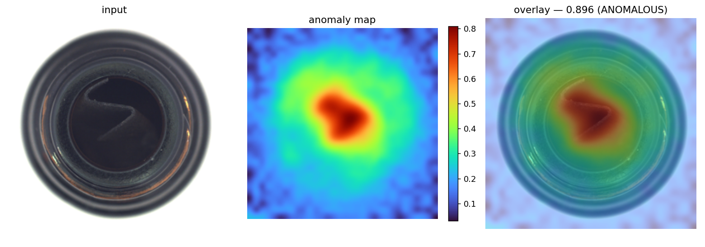
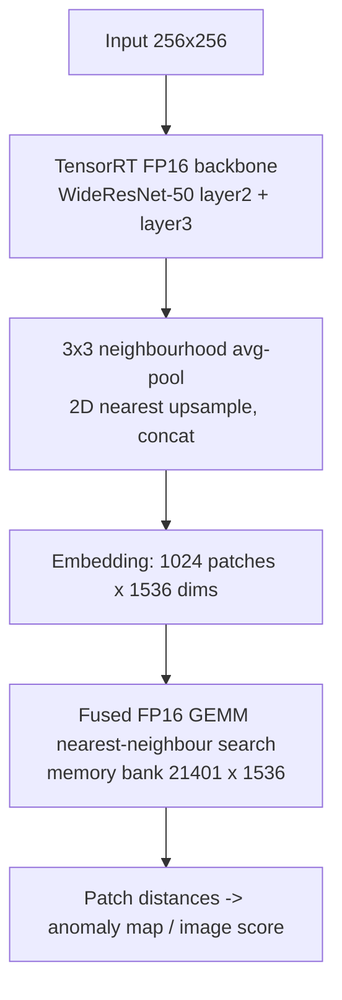

# PatchCore on TensorRT — Industrial Anomaly Detection Inference Optimization

End-to-end optimization of a PatchCore anomaly detector from a PyTorch prototype to a
GPU-resident TensorRT pipeline: **60 → 295 images/s (4.9×) at image-AUROC 1.000**, on a
single RTX 4070 Laptop GPU.

The interesting part of this project is not the model — PatchCore is off-the-shelf from
[anomalib](https://github.com/openvinotoolkit/anomalib). It is the profiling. The
dominant cost in a naive deployment turned out to be **host↔device data movement, not
arithmetic**, and once the transfers were gone the bottleneck was the nearest-neighbour
search rather than the CNN backbone. Three silent correctness bugs surfaced along the
way; they are documented below, because finding them was most of the work.



*MVTec AD `bottle`, contamination defect. Left: input. Centre: anomaly map. Right: overlay.*

---

## Results

MVTec AD, category `bottle`, batch size 1, 256×256 input, RTX 4070 Laptop GPU.

### Latency

| Configuration | Latency (mean) | Throughput | What changed |
|---|---:|---:|---|
| PyTorch FP32 | ~16.7 ms | ~60 img/s | baseline |
| PyTorch FP16 | ~10.0 ms | ~100 img/s | `model.half()` |
| TensorRT FP16, naive integration | 17.5 ms | 57 img/s | backbone accelerated, but outputs round-trip through host memory |
| \+ ORT IO-Binding, GPU-resident search | 6.25 ms | 160 img/s | removes 4 PCIe transfers per frame |
| **\+ fused FP16 GEMM search** | **3.39 ms** | **295 img/s** | ‖b‖² folded into the GEMM |

p50 3.35 ms · p95 3.62 ms · p99 4.16 ms · **4.9× over the PyTorch FP32 baseline**

> The 160 img/s row predates the stream-synchronisation fix and is indicative rather
> than directly comparable; the final row carries ~0.38 ms of explicit synchronisation
> that the intermediate configurations did not.

### Where the 3.39 ms goes

| Stage | Time |
|---|---:|
| TensorRT FP16 backbone + post-processing (incl. stream sync) | 1.25 ms |
| Nearest-neighbour search (21 401 × 1536 memory bank) | 2.24 ms |
| **End-to-end** | **3.39 ms** |

### Accuracy

Two separate things are verified, and they answer different questions.

**Kernel fidelity** — does the FP16 GEMM compute the same distances as an exact FP32 CPU
search? Relative error **6.49e-05** on the image score. This validates the optimization,
not the model.

**Detection quality** — does the optimized pipeline still find defects? Measured with
`benchmark/eval_auroc.py` on the full MVTec AD `bottle` test split (83 images, 20 normal
/ 63 defective), through the exact pipeline the benchmark above times:

| Metric | anomalib reference | This pipeline |
|---|---:|---:|
| image-AUROC | 1.000 | **1.0000** |
| pixel-AUROC | ~0.98 | **0.9851** |
| F1 @ threshold 38.84 | — | **1.0000** (TP 63 · FP 0 · FN 0) |

Score separation: normal **21.98 – 29.81**, defective **40.11 – 78.92**. The learned
threshold sits in a gap of 10.3 with no samples in it — AUROC 1.000 says the ordering is
perfect, the gap says there is margin behind it.

### GPU memory

| Mode | Allocated | Reserved | Peak |
|---|---:|---:|---:|
| PyTorch FP32 | 231 MB | 386 MB | 367 MB |
| PyTorch FP16 | 119 MB | 248 MB | 187 MB |

---

## Pipeline



Everything from the input tensor to the final scalar stays in device memory. Exactly one
4-byte value crosses PCIe per frame.

---

## Key finding: the bottleneck was data movement

The first TensorRT integration was *slower* than PyTorch FP16 — 57 vs 100 img/s — which
is the observation the whole project grew out of. Timing the stages separately showed the
backbone accounted for under 1 ms. The other ~16 ms was overhead:

| Per-frame host round-trip | Direction | Size |
|---|---|---:|
| ONNX Runtime returns outputs as numpy | D→H | 3.1 MB |
| `torch.from_numpy(...).cuda()` | H→D | 3.1 MB |
| `feat.cpu().numpy()` to build the query | D→H | 6.3 MB |
| FAISS copies the query back to the device | H→D | 6.3 MB |

~19 MB per frame through non-pinned memory, plus four implicit synchronisations. The fix
was ONNX Runtime **IO-Binding** — model input and outputs bound to the `data_ptr()` of
pre-allocated CUDA tensors — and a search that consumes a device tensor directly.
That alone was 57 → 160 img/s. No kernel was rewritten.

## Then: collapsing the search into one GEMM

With transfers gone, 5.4 of the remaining 6.25 ms was the nearest-neighbour search. The
naive formulation materialises the full `[1024 x 21401]` distance matrix several times
over — one temporary per elementwise op, roughly 500 MB of memory traffic per frame on a
GPU with 256 GB/s of bandwidth.

Since `‖q‖²` is constant within a query row it drops out of the `argmin`, which then
depends only on `‖b‖² − 2q·b`. That folds into a single matrix product by augmenting both
operands:

```
q' = [ q , 1 ]                 (D+1)
b' = [ -2b , ‖b‖² ]            (D+1)
q'·b' = ‖b‖² − 2 q·b
```

`‖q‖²` is added back after the reduction. The search becomes one FP16 tensor-core GEMM
followed by one `min`, with no intermediate elementwise passes: traffic drops from
~500 MB to ~88 MB per frame, and the stage goes from 5.40 ms to 2.24 ms.

At that point the search is compute-bound at roughly 30 TFLOPS effective — about half of
what the GPU can do on this shape — so further gains would have to come from reducing
FLOPs (a smaller coreset, or random projection with exact re-ranking) rather than from
tuning the kernel.

## Comparison against FAISS

| Nearest-neighbour backend | End-to-end latency | Throughput |
|---|---:|---:|
| FAISS GPU `IndexFlatL2` (fp16), query from host | ~17.5 ms | 57 img/s |
| FAISS GPU `IndexFlatL2` (fp16), device pointers | 7.48 ms | 134 img/s |
| Fused FP16 GEMM (this repo) | 3.39 ms | 295 img/s |

This is **not** a claim to be faster than FAISS in general. At this specific operating
point — `k = 1`, batch 1, a bank of only 21 k vectors that fits comfortably in device
memory — FAISS's tiling strategy and its general-purpose k-selection kernel are solving a
harder problem than the one at hand. Folding `‖b‖²` into the GEMM reduces the whole search
to a matrix multiply and a reduction with no intermediate distance matrix. For large
banks, `k > 1`, or multi-GPU sharding, FAISS is the right tool.

---

## Correctness issues found and fixed

Three bugs in earlier revisions produced plausible-looking anomaly scores while being
wrong. All three are silent — the program runs, the score is finite, nothing warns you.

**1. Missing neighbourhood aggregation.** anomalib applies `AvgPool2d(3, stride=1,
padding=1)` to each feature map before building the memory bank (PatchCore's local
neighbourhood aggregation). Skipping it at inference puts the query features in a
different distribution from the stored ones, biasing every distance.

**2. Upsampling after flattening scrambles the patch grid.** Interpolating layer3 to
layer2's resolution *after* `flatten(2)` performs a 1-D nearest resample with the mapping
`k -> k//4`, whereas correct 2-D upsampling maps `(i, j) -> (i//2, j//2)`. These differ:
output patch `(0, 4)` reads bank patch 1 instead of patch 2. The image-level max score
partially survives this; the anomaly map does not. The upsample must happen on the
`[B, C, H, W]` tensor, before flattening:

```python
f_lo = F.avg_pool2d(f_lo, 3, stride=1, padding=1)
f_lo = F.interpolate(f_lo, size=f_hi.shape[-2:], mode="nearest")
emb  = torch.cat([f_hi, f_lo], 1).permute(0, 2, 3, 1).reshape(-1, dim)
```

**3. CUDA-graph replay pinned stale input.** With `trt_cuda_graph_enable`, writes to the
bound input buffer never reached the engine — every test image produced an identical
score, and image-AUROC came out at exactly 0.5000. The latency benchmark could not catch
this because it fed one fixed tensor 200 times, so a pipeline ignoring its input entirely
still produced plausible timings and a plausible score. Fixed by making graph capture
opt-in, synchronising PyTorch's stream against ONNX Runtime's, and adding an
input-sensitivity assertion to both entry points:

```python
def assert_input_sensitive(bs, tol=1e-6):
    """Two different inputs must produce different features."""
    bs.x.normal_(); a = bs.run()[0].clone()
    bs.x.normal_(); b = bs.run()[0].clone()
    if (a - b).abs().max().item() < tol:
        raise SystemExit("engine is not reading its input buffer")
```

The evaluation script carries the same guard at the other end: if the standard deviation
across all image scores is ~0, it aborts rather than reporting a meaningless AUROC.

---

## Reproducing

> PyTorch is a CUDA 12.1 build; install it first from the official index:
> `pip install torch==2.5.1 torchvision==0.20.1 --index-url https://download.pytorch.org/whl/cu121`

```bash
pip install -r requirements.txt

# 1. train / obtain the PatchCore checkpoint (see below)
# 2. export the feature extractor
python benchmark/export_patchcore_onnx.py

# 3. latency
python benchmark/benchmark_trt_patchcore.py \
    --onnx models/patchcore_feature_extractor.onnx \
    --ckpt results/Patchcore/MVTecAD/bottle/v0/weights/lightning/model.ckpt \
    --search torch

# 4. accuracy
python benchmark/eval_auroc.py \
    --onnx models/patchcore_feature_extractor.onnx \
    --ckpt results/Patchcore/MVTecAD/bottle/v0/weights/lightning/model.ckpt \
    --data-root /path/to/mvtec --category bottle --pixel
```

The first TensorRT run builds and caches an engine in `./trt_cache` (one-off, 1–2 min).

`--search faiss` reproduces the FAISS comparison; `--cuda-graph` re-enables graph capture
(the input-sensitivity assertion will tell you whether it is safe on your stack).

### Checkpoint and dataset

The trained checkpoint is not committed. Reproduce it with:

```bash
python src/train_patchcore.py --category bottle
```

MVTec AD must be downloaded separately from
[MVTec](https://www.mvtec.com/company/research/datasets/mvtec-ad) (research use).
`--data-root` should point at the directory containing `bottle/`.

---

## Notes and limitations

- Latency is measured on synthetic input tensors. Exact flat search is data-independent,
  so the timings transfer to real images; accuracy is measured separately on the real
  test split, through the same pipeline.
- Batch size 1 only. This targets per-item latency on an inspection line; a
  throughput-oriented deployment would batch and see higher images/s.
- Single category (`bottle`). Each category needs its own memory bank, and search cost
  scales linearly with bank size, so a category with a larger coreset will be slower.
- `coreset_sampling_ratio` is left at anomalib's default of 0.1. Lowering it trades
  accuracy for a proportional reduction in search time — the obvious next axis, and the
  one where an accuracy/latency Pareto curve would be worth plotting.
- INT8 calibration was not attempted.

## Environment

| | |
|---|---|
| GPU | NVIDIA RTX 4070 Laptop |
| OS | Ubuntu on WSL2 |
| Python | 3.10 |
| PyTorch | 2.5.1+cu121 |
| ONNX Runtime | onnxruntime-gpu 1.23.2 |
| TensorRT | 10.9.0.34 |
| anomalib | 2.5.1 |

Exact versions are pinned in `requirements.txt`. The TensorRT execution provider is
sensitive to CUDA / TensorRT / ONNX Runtime version alignment; if the provider list does
not contain `TensorrtExecutionProvider` at startup, that is almost always the cause.

## Repository layout
```
.
├── src/
│   ├── train_patchcore.py
│   ├── infer.py
│   └── infer_single.py            # single-image demo + heat-map figure
├── benchmark/
│   ├── memory_test.py
│   ├── benchmark_fp32.py
│   ├── benchmark_fp16.py
│   ├── export_patchcore_onnx.py
│   ├── benchmark_trt_feature.py
│   ├── benchmark_trt_patchcore.py
│   └── eval_auroc.py
├── models/                        # exported ONNX lands here (not committed)
├── results/
│   └── environment.txt
├── docs/
│   └── detection_example.png
└── requirements.txt
```
